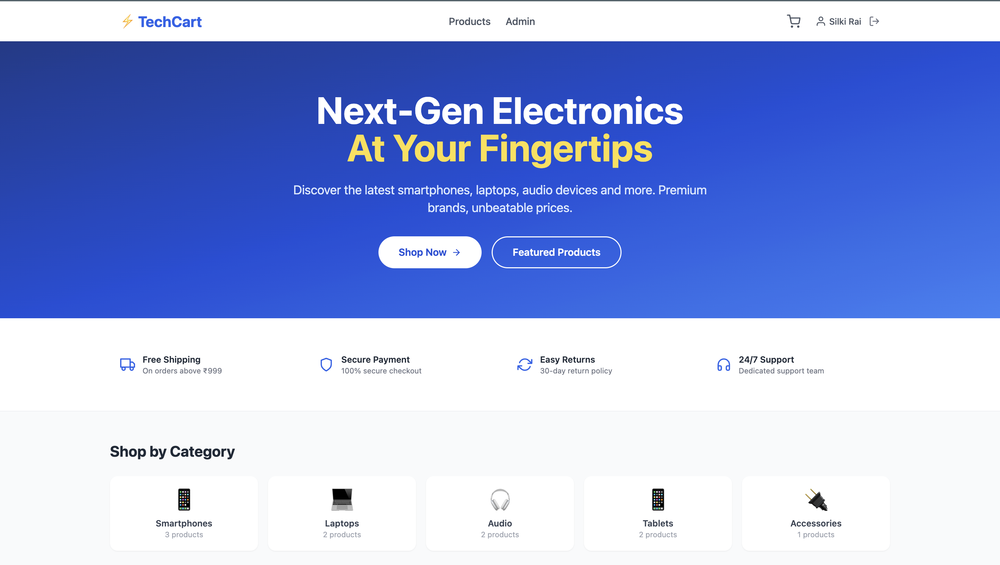
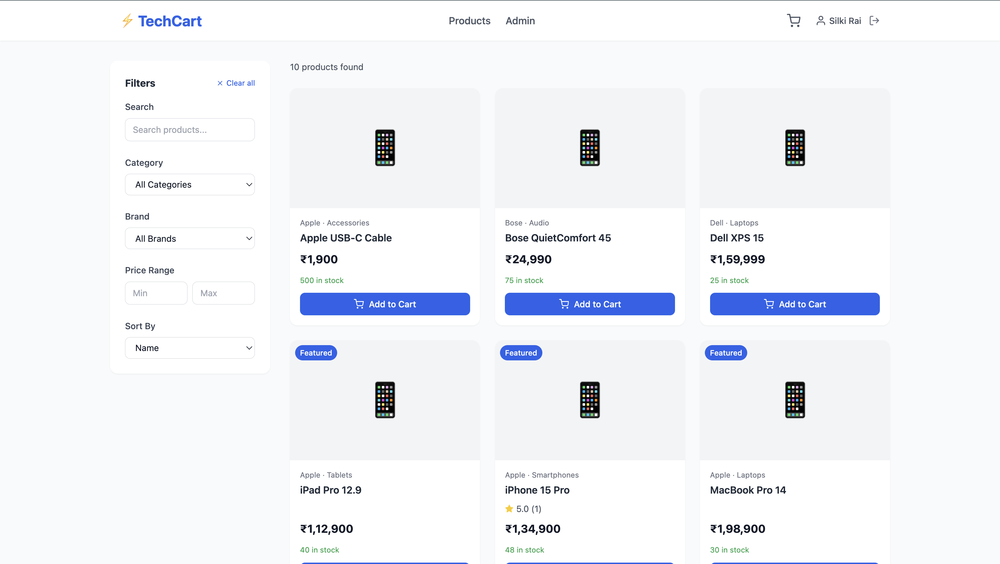
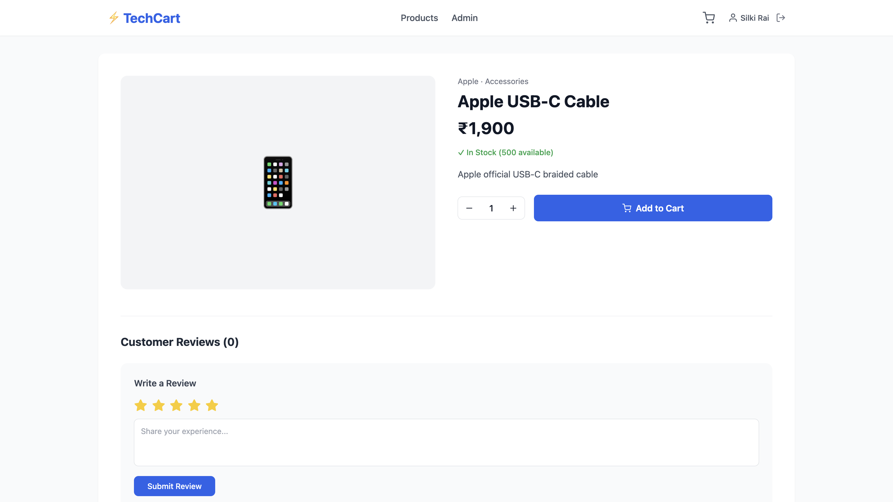
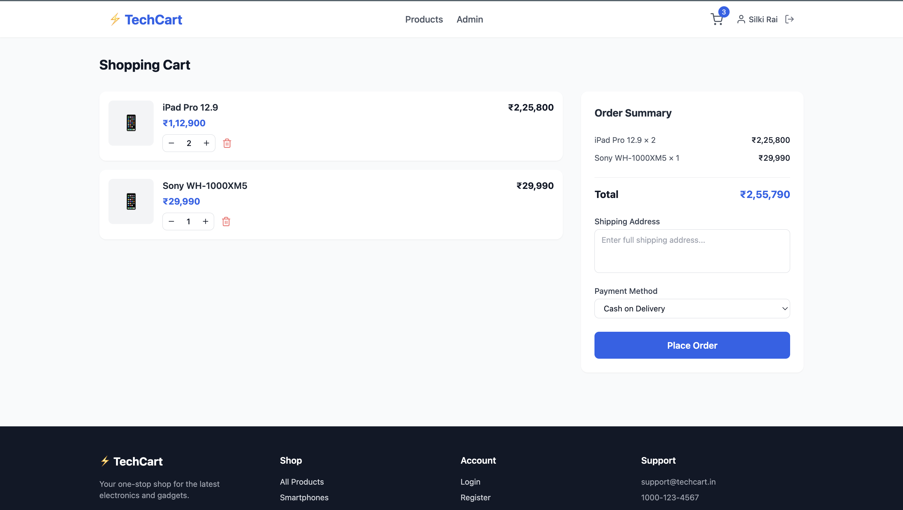
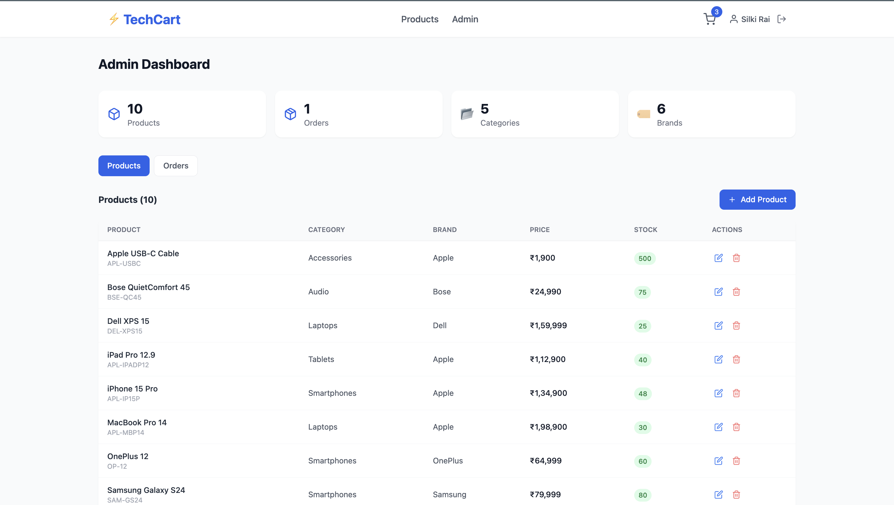

# ⚡ TechCart — B2C Electronics Store

A full-stack B2C e-commerce application for electronics built with **ASP.NET Core 8 Web API** and **React + Vite + TailwindCSS**. Features JWT authentication, shopping cart, order management, product reviews, and a complete admin dashboard.

---

## 🖥️ Live Demo

- **Frontend:** https://tech-cart-omega.vercel.app
- **Backend:** Runs locally via Docker (see setup below)
- **API Docs:** http://localhost:5144/swagger

---

## 📸 Screenshots

### Home Page


### Products Page


### Product Detail


### Shopping Cart


### Admin Dashboard


---

## ✨ Features

### Customer Features
- 🔐 Register and login with JWT authentication
- 🛍️ Browse products with search, filter and pagination
- 🔍 Filter by category, brand, price range
- 📱 Product detail page with specifications and reviews
- ⭐ Add product reviews and ratings (1–5 stars)
- 🛒 Shopping cart — add, update quantity, remove items
- 📦 Place orders with shipping address and payment method
- 📋 View order history and order details
- 📱 Fully responsive — works on mobile and desktop

### Admin Features
- 📊 Admin dashboard with stats overview
- ➕ Add, edit, delete products
- 🏷️ Manage categories and brands
- 📦 View all orders and update order status
- 🔒 Role-based access control (Admin / Customer)

---

## 🛠️ Tech Stack

### Backend
| Technology | Version | Purpose |
|------------|---------|---------|
| ASP.NET Core | 8.0 | Web API framework |
| Entity Framework Core | 8.0 | ORM for database access |
| SQL Server 2022 | Latest | Relational database |
| JWT Bearer | 8.0 | Authentication and authorization |
| BCrypt.Net | 4.0.3 | Password hashing |
| Swagger / OpenAPI | 6.5 | API documentation |

### Frontend
| Technology | Version | Purpose |
|------------|---------|---------|
| React | 18 | UI library |
| Vite | 5 | Build tool and dev server |
| TailwindCSS | 3 | Utility-first CSS framework |
| React Router | 6 | Client-side routing |
| Axios | Latest | HTTP client |
| React Hot Toast | Latest | Toast notifications |
| React Icons | Latest | Icon library |

### Infrastructure
| Tool | Purpose |
|------|---------|
| Docker Desktop | Runs SQL Server 2022 locally |
| Git | Version control |

---

## 📁 Project Structure

```
TechCart/
├── backend/
│   └── TechCartAPI/
│       ├── Controllers/
│       │   ├── AuthController.cs
│       │   ├── ProductsController.cs
│       │   ├── CategoriesController.cs
│       │   ├── BrandsController.cs
│       │   ├── CartController.cs
│       │   ├── OrdersController.cs
│       │   └── ReviewsController.cs
│       ├── Data/
│       │   └── TechCartContext.cs
│       ├── DTOs/
│       │   ├── AuthDTOs.cs
│       │   ├── ProductDTOs.cs
│       │   ├── CartDTOs.cs
│       │   ├── OrderDTOs.cs
│       │   └── ReviewDTOs.cs
│       ├── Models/
│       │   ├── User.cs
│       │   ├── Product.cs
│       │   ├── Category.cs
│       │   ├── Brand.cs
│       │   ├── Order.cs
│       │   ├── OrderItem.cs
│       │   ├── CartItem.cs
│       │   └── Review.cs
│       ├── Services/
│       │   └── TokenService.cs
│       ├── Migrations/
│       ├── appsettings.json
│       └── Program.cs
└── frontend/
    └── src/
        ├── components/
        │   ├── Navbar.jsx
        │   ├── Footer.jsx
        │   ├── ProductCard.jsx
        │   └── LoadingSpinner.jsx
        ├── context/
        │   ├── AuthContext.jsx
        │   └── CartContext.jsx
        ├── pages/
        │   ├── HomePage.jsx
        │   ├── ProductsPage.jsx
        │   ├── ProductDetailPage.jsx
        │   ├── LoginPage.jsx
        │   ├── RegisterPage.jsx
        │   ├── CartPage.jsx
        │   ├── OrdersPage.jsx
        │   └── AdminPage.jsx
        ├── services/
        │   └── api.js
        └── App.jsx
```

---

## 🗄️ Database Schema

```
Users
│ UserId, FirstName, LastName, Email, PasswordHash, Role
│
├── 1:N ──► Orders
│              │
│              └── 1:N ──► OrderItems ──► Products
│
├── 1:N ──► CartItems ──► Products
│
└── 1:N ──► Reviews ──► Products
                              │
                         ├── Categories
                         └── Brands
```

### Tables
- **Users** — customer and admin accounts
- **Products** — electronics catalog with pricing, stock, specs
- **Categories** — Smartphones, Laptops, Audio, Tablets, Accessories
- **Brands** — Apple, Samsung, Sony, Dell, OnePlus, Bose
- **Orders** — customer orders with status tracking
- **OrderItems** — line items per order
- **CartItems** — persistent shopping cart per user
- **Reviews** — product reviews with 1–5 star ratings

---

## 🚀 Local Setup

### Prerequisites

- [.NET 8 SDK](https://dotnet.microsoft.com/download)
- [Node.js v20+](https://nodejs.org/)
- [Docker Desktop](https://www.docker.com/products/docker-desktop/)
- [Git](https://git-scm.com/)

---

### 1. Clone the Repository

```bash
git clone https://github.com/silkirai1812/TechCart
cd TechCart
```

---

### 2. Start SQL Server via Docker

```bash
docker run -e "ACCEPT_EULA=Y" \
  -e "MSSQL_SA_PASSWORD=Train1234Abc" \
  -p 1433:1433 \
  --name sqlserver2022 \
  -d mcr.microsoft.com/mssql/server:2022-latest

# Verify it's running
docker ps
```

> On subsequent runs, just use: `docker start sqlserver2022`

---

### 3. Configure Backend

Open `backend/TechCartAPI/appsettings.json` and set:

```json
{
  "ConnectionStrings": {
    "DefaultConnection": "Server=127.0.0.1,1433;Database=TechCartDB;User Id=SA;Password=Train1234Abc;TrustServerCertificate=True;"
  },
  "Jwt": {
    "Key": "TechCart$SecretKey2024!XyZ@SuperSecure#123",
    "Issuer": "TechCartAPI",
    "Audience": "TechCartClient",
    "ExpiryInMinutes": 60
  }
}
```

---

### 4. Run the Backend

```bash
cd backend/TechCartAPI

# Install EF Core CLI (first time only)
dotnet tool install --global dotnet-ef

# Apply migrations — creates tables and seeds data automatically
dotnet ef database update

# Start the API
dotnet run
```

- API: `http://localhost:5144`
- Swagger UI: `http://localhost:5144/swagger`

---

### 5. Run the Frontend

```bash
cd frontend
npm install
npm run dev
```

- App: `http://localhost:5173`

---

### 6. Create Admin User

Register an account on the app first, then run:

```bash
docker exec -it sqlserver2022 /opt/mssql-tools18/bin/sqlcmd \
  -S localhost -U SA -P "Train1234Abc" -No \
  -Q "USE TechCartDB; UPDATE Users SET Role = 'Admin' WHERE Email = 'your@email.com';"
```

Log out and log back in — the Admin link will appear in the navbar.

---

## 🔌 API Endpoints

### Authentication
| Method | Endpoint | Description | Auth |
|--------|----------|-------------|------|
| POST | `/api/auth/register` | Register new user | ❌ |
| POST | `/api/auth/login` | Login and get JWT token | ❌ |

### Products
| Method | Endpoint | Description | Auth |
|--------|----------|-------------|------|
| GET | `/api/products` | Get all products (filter, search, paginate) | ❌ |
| GET | `/api/products/{id}` | Get product by ID with reviews | ❌ |
| POST | `/api/products` | Create product | 🔐 Admin |
| PUT | `/api/products/{id}` | Update product | 🔐 Admin |
| DELETE | `/api/products/{id}` | Soft delete product | 🔐 Admin |

### Categories & Brands
| Method | Endpoint | Description | Auth |
|--------|----------|-------------|------|
| GET | `/api/categories` | Get all categories | ❌ |
| POST | `/api/categories` | Create category | 🔐 Admin |
| GET | `/api/brands` | Get all brands | ❌ |
| POST | `/api/brands` | Create brand | 🔐 Admin |

### Cart
| Method | Endpoint | Description | Auth |
|--------|----------|-------------|------|
| GET | `/api/cart` | Get user's cart | 🔐 User |
| POST | `/api/cart` | Add item to cart | 🔐 User |
| PUT | `/api/cart` | Update cart item quantity | 🔐 User |
| DELETE | `/api/cart/{id}` | Remove cart item | 🔐 User |
| DELETE | `/api/cart/clear` | Clear entire cart | 🔐 User |

### Orders
| Method | Endpoint | Description | Auth |
|--------|----------|-------------|------|
| GET | `/api/orders` | Get my orders | 🔐 User |
| GET | `/api/orders/{id}` | Get order by ID | 🔐 User |
| POST | `/api/orders` | Place order | 🔐 User |
| PUT | `/api/orders/{id}/status` | Update order status | 🔐 Admin |
| GET | `/api/orders/admin/all` | Get all orders | 🔐 Admin |

### Reviews
| Method | Endpoint | Description | Auth |
|--------|----------|-------------|------|
| GET | `/api/reviews/product/{id}` | Get product reviews | ❌ |
| POST | `/api/reviews` | Add review | 🔐 User |
| DELETE | `/api/reviews/{id}` | Delete review | 🔐 User/Admin |

---

## 🔐 Authentication Flow

```
User submits credentials
        ↓
Backend validates email + BCrypt password hash
        ↓
JWT token generated with userId, email, role claims
        ↓
Token returned to frontend
        ↓
Frontend stores token in localStorage
        ↓
Every request sends: Authorization: Bearer {token}
        ↓
Backend validates token on protected endpoints
```

---

## 🌱 Seed Data

Pre-loaded on first run:

**Categories:** Smartphones · Laptops · Audio · Tablets · Accessories

**Brands:** Apple · Samsung · Sony · Dell · OnePlus · Bose

**Products:**
| Product | Brand | Price |
|---------|-------|-------|
| iPhone 15 Pro | Apple | ₹1,34,900 |
| Samsung Galaxy S24 | Samsung | ₹79,999 |
| MacBook Pro 14 | Apple | ₹1,98,900 |
| Dell XPS 15 | Dell | ₹1,59,999 |
| Sony WH-1000XM5 | Sony | ₹29,990 |
| Bose QuietComfort 45 | Bose | ₹24,990 |
| iPad Pro 12.9 | Apple | ₹1,12,900 |
| Samsung Galaxy Tab S9 | Samsung | ₹72,999 |
| OnePlus 12 | OnePlus | ₹64,999 |
| Apple USB-C Cable | Apple | ₹1,900 |

---

## 🧠 Key Design Decisions

**Why DTOs?**
Entity models are never exposed directly to the API. DTOs control exactly what data goes in and out — prevents over-posting and sensitive data leakage.

**Why Soft Delete?**
Products are never hard-deleted. Setting `IsActive = false` preserves order history — you cannot delete a product that exists in past orders.

**Why JWT over Sessions?**
JWT is stateless — the server stores nothing. Scales across multiple servers and is the industry standard for REST APIs.

**Why EF Core over raw SQL?**
Type safety, migration management, and LINQ queries. Raw SQL is available via `FromSqlRaw` when needed.

---

## ⚡ Daily Startup

```bash
# 1. Open Docker Desktop and wait for whale icon

# 2. Start SQL Server
docker start sqlserver2022

# 3. Start backend (Terminal 1)
cd backend/TechCartAPI
dotnet run

# 4. Start frontend (Terminal 2)
cd frontend
npm run dev
```

---

## 📄 License

This project is open source and available under the [MIT License](LICENSE).

---

## 🙏 Acknowledgements

- [Microsoft ASP.NET Core Documentation](https://docs.microsoft.com/aspnet/core)
- [Entity Framework Core Documentation](https://docs.microsoft.com/ef/core)
- [React Documentation](https://react.dev)
- [TailwindCSS Documentation](https://tailwindcss.com)